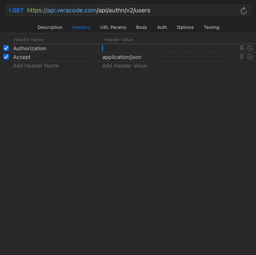

# Veracode HMAC Authorization Dynamic Value Extension

An extension for the RapidApi (Paw) REST Client to authenticate into the Veracode REST APIs using HMAC.

## Setup

If you already have your Veracode Credentials file setup, just add the Veracode HMAC Authorization Dynamic Value as the value to the requests's Authorization header. This will pull the default credentials. If you do not already have your Veracode API Credentials setup, follow [the official Veracode API Credential](https://docs.veracode.com/r/c_configure_api_cred_file) docs.

If you have more than one Veracode credential profile defined in your `~/.veracode/credentials` you can specify which profile to authenticate with. Create an environment variable with the value of the api creds profile you're using, and in the Dynamic Value select your newly created environment variable.
